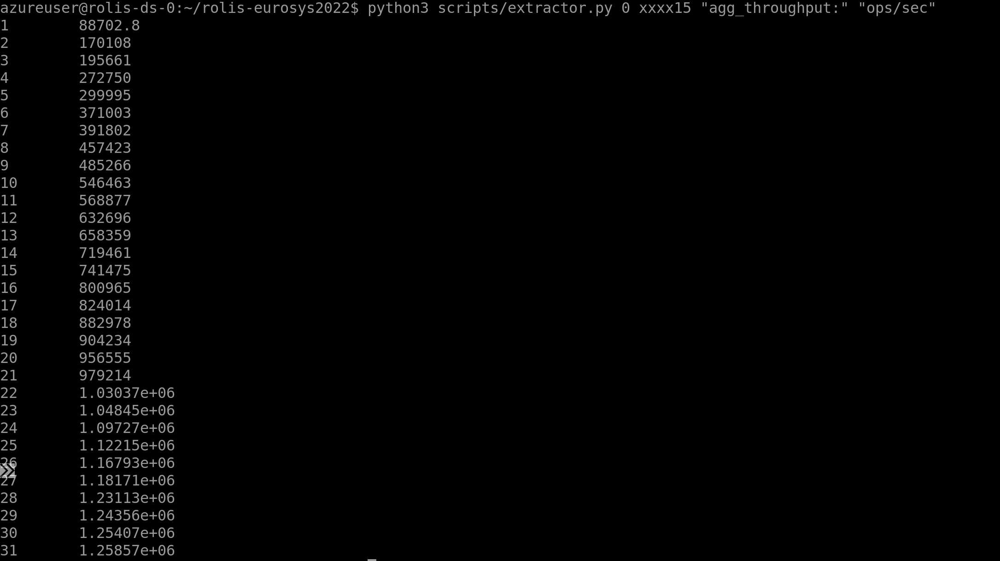
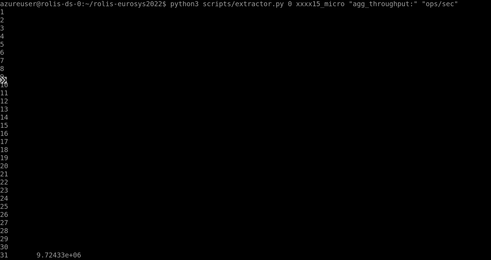
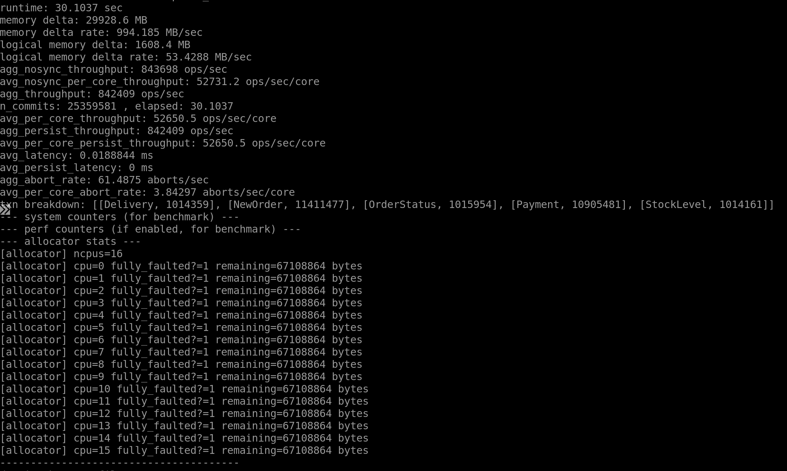
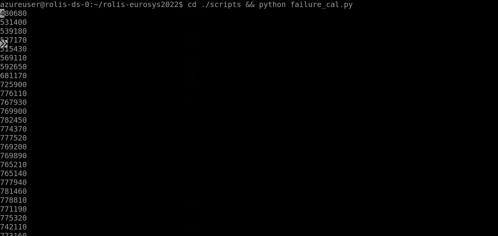

### Experiment-1: Silo-only on TPC-C (Figure-10-a)
```bash
# on the leader replica
sudo ./multi-silo-only.sh 1 31
```
In this experiment, we run Silo solely up to 31 worker threads, it will finish the entire experiments in 25 minutes (*50 * 31/60*). Then you can obtain all performance numbers from 1 ~ 31 threads, by

```bash
python3 scripts/extractor.py 0 silo-only-logs "agg_throughput:" "ops/sec"
```

### Experiment-2: Throughput of Rolis on TPC-C benchmark (Figure-10-a)
* compile the program on the leader replica
```bash
# on the leader replica
# re-compile
sudo bash ./multi.sh

# kill the running processes on all replicas
bash ./batch_silo.sh kill

# sync modifications
bash ./batch_silo.sh scp
```
* run the experiments on three replicas separately one by one

on the leader replica: 10.1.0.7 
```bash
# this process will stop after completion
ulimit -n 10000 && python3 scripts/leader_b.py 1 31 1
```
on the p2 follower replica: 10.1.0.9
```bash
# this process will stop after completion
ulimit -n 10000 && python3 scripts/follower_b2.py 1 31 1
```
on the p1 follower replica: 10.1.0.8
```bash
# this process will stop after completion
ulimit -n 10000 && python3 scripts/follower_b1.py 1 31 1
```
The order of execution matters, executing the command on the p2 follower replica at first as above. In this experiment, we conduct an experiment to get the performance of Rolis on TPC-C benchmark by varying the number of CPU cores. Each run would take 1 minute, thus it will run up to 31 minutes (31 * 1 minute). We redirect all results into the folder `xxxx15`, thus you can obtain the performance numbers from 1 ~ 31 CPU cores, by
```bash
python3 scripts/extractor.py 0 xxxx15 "agg_throughput:" "ops/sec"
```
The major results would like below, Rolis can achieve about 1.259M (the number claimed in the paper is 1.24M, you should observe a similar number which depends on the servers) throughput on 32 cores.


### Experiment-3: Silo-only on YCSB++ (Figure-10-b)
```bash
# on the leader replica
sudo ./multi-silo-only-m.sh 1 31
```
Similar to Experiment-1, get numbers by,

```bash
python3 scripts/extractor.py 0 silo-only-logs-m "agg_throughput:" "ops/sec"
```

### Experiment-4: Throughput of Rolis on YCSB++ benchmark (Figure-10-b)
Same to Experiment-2, except replacing the script names as follow,
```
leader_b.py  => leader_b_m.py
follower_b2.py  => follower_b2_m.py
follower_b1.py  => follower_b1_m.py
```
Then get the numbers by,
```bash
python3 scripts/extractor.py 0 xxxx15_micro "agg_throughput:" "ops/sec"
```
Rolis can achieve about ~10M reported in the paper throughput on 32 cores. As below (I only run it with 31 worker threads), the throughput is `9.724M`.


### Experiment-5 (Figure-11):
All numbers in `Figure-11` is  reciprocal of ones from `Figure-10`.

### Experiment-6: Failover (Figure-14)
At first, we recompile it
```
sudo  bash ./multi-failover.sh
bash ./batch_silo.sh kill
bash ./batch_silo.sh scp
sudo bash ./multi-failover-variable.sh
```

* run the experiments on three replicas separately one by one

on the leader replica: 10.1.0.7 
```bash
# this process will stop after completion
ulimit -n 10000 
sudo ./b0.sh 16
tail -f ./xxxx15/*
```
on the p2 follower replica: 10.1.0.9
```bash
ulimit -n 10000
sudo ./b2.sh 16
tail -f ./xxxx15/*
```
on the p1 follower replica: 10.1.0.8
```bash
# this process will stop after completion
ulimit -n 10000
sudo ./b1.sh 16
tail -f ./xxxx15/*
```

Wait for either follower-1 or follower-2 to complete the job which depends on whom is going to be elected as the new leader.


Lastly, we can obtain numbers on the leader replica via
```bash
# copy logs from remote machines
./batch_silo.sh copy_remote_file ./xxxx15/follower-16.log  && mv p1p2.log ./scripts/failure_follower && cp ./xxxx15/leader-16-1000.log ./scripts/failure_leader

cd ./scripts && python failure_cal.py
```
the results are the throughput changes over the time


### Experiment-7: latency ovar different batch-sizes (Figure-16)
In this experiment, we'll fix the number of worker threads while varying the batch-size of transactions. At first, compile the system
```bash
# on the leader replica
git checkout benchmarks/bench.cc  # revert the changes made in the fail-over experiment
sudo  bash ./multi-latency.sh
bash ./batch_silo.sh scp
bash ./batch_silo.sh kill
```
Now, let's get the latency for all possible cases, batch-size: 50, 100, 200, 400, 800, 1600, 3200. It will take about up to 7 * 65 = 455 seconds.
```bash
bash ./batch_size_exp.sh
```
After that, you can get all the latency numbers via 
```
ag '% latency' xxxx15
```


### Experiment-8: Throughput over different batch-sizes (Figure-16)
Let's we stop tracking latency and record the throughput of Rolis over different batch-sizes. It's similar to Experiment-7. At first, compile the system
```bash
# on the leader replica
sudo  bash ./multi.sh
bash ./batch_silo.sh scp
bash ./batch_silo.sh kill
```
Then, let's get the throughput of Rolis with different batch-sizes.
```bash
bash ./batch_size_exp.sh
```
After that, you can get all latency numbers via
```
ag 'agg_throughput: ' xxxx15
```


## References
* Eurosys badges: https://sysartifacts.github.io/eurosys2022/badges
